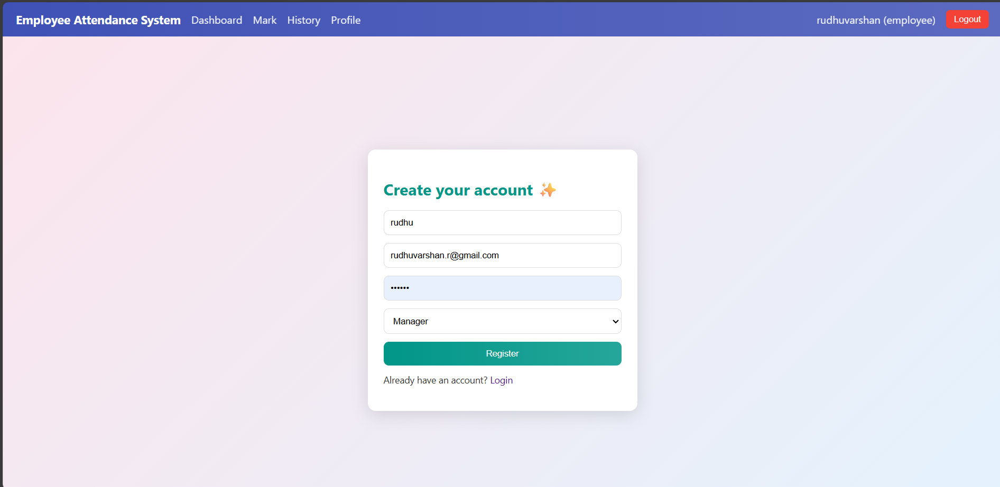

# Employee-Attendance-System

📅 A comprehensive Employee Attendance Management System built with MERN stack

A full-stack MERN (MongoDB, Express, React, Node.js) application for tracking employee attendance with real-time updates, role-based dashboards, and comprehensive reporting. This system provides distinct interfaces for Employees to mark attendance and view history, and for Managers to oversee team records, generate reports, and analyze attendance patterns.

## 🚀 Features

### 👤 Employee Module

- **Secure Authentication**: JWT-based register and login with password hashing (BcryptJS)
- **Daily Attendance**: "Check In" and "Check Out" functionality with timestamps
- **Real-time Status**: Automatic status detection:
  - ✅ **Present**: Checked in on time (before 9:00 AM)
  - ⚠️ **Late**: Checked in after 9:00 AM
  - ❌ **Absent**: No check-in for the day
- **Work Duration**: Automatic calculation of daily work hours upon check-out
- **Personal History**: View attendance records with filtering and search
- **Profile Management**: Update personal information
- **Dashboard**: Real-time overview of today's status and quick actions

### 🛡️ Manager Module

- **Team Overview**: View real-time attendance records for all team members
- **Calendar View**: Visual representation of team attendance in calendar format
- **Attendance Records**: Comprehensive list view with sorting and filtering
- **Analytics & Reports**: Generate detailed attendance reports
- **Employee History**: Drill down into specific employee attendance records
- **Dashboard**: Quick statistics and team performance metrics
- **Professional Dashboard**: Modern UI with gradient cards and real-time stats

## 🛠️ Tech Stack

### Frontend
- **React.js 19.2.0**: UI library
- **React Router DOM**: Client-side routing
- **Redux Toolkit**: State management
- **Tailwind CSS 3.4.18**: Utility-first CSS framework
- **Vite 7.2.4**: Build tool and dev server
- **ESLint**: Code quality

### Backend
- **Node.js**: JavaScript runtime
- **Express.js**: Web framework (ES Modules)
- **MongoDB & Mongoose**: Database and ODM
- **JWT (JSON Web Tokens)**: Authentication
- **BcryptJS**: Password hashing
- **Dotenv**: Environment variables

## 📁 Project Structure

```
ATTS/
├── backend/
│   ├── config/
│   │   └── db.js                 # MongoDB connection
│   ├── controllers/
│   │   ├── attendanceController.js
│   │   └── authController.js
│   ├── middleware/
│   │   └── auth.js               # JWT verification
│   ├── models/
│   │   ├── Attendance.js
│   │   └── User.js
│   ├── routes/
│   │   ├── attendanceRoutes.js
│   │   └── authRoutes.js
│   ├── .env.example              # Environment variables template
│   ├── .gitignore
│   ├── package.json
│   ├── seed.js                   # Database seeding script
│   └── server.js                 # Entry point
│
├── frontend/
│   ├── public/                   # Static assets
│   ├── src/
│   │   ├── api/
│   │   │   └── axios.js          # API configuration
│   │   ├── app/
│   │   │   └── store.js          # Redux store
│   │   ├── components/
│   │   │   └── Navbar.jsx        # Navigation component
│   │   ├── features/
│   │   │   ├── attendance/
│   │   │   │   ├── attendanceApi.js
│   │   │   │   └── attendanceSlice.js
│   │   │   └── auth/
│   │   │       ├── authApi.js
│   │   │       └── authSlice.js
│   │   ├── pages/
│   │   │   ├── Login.jsx
│   │   │   ├── Register.jsx
│   │   │   ├── employee/
│   │   │   │   ├── AttendanceHistory.jsx
│   │   │   │   ├── EmployeeDashboard.jsx  # Enhanced UI
│   │   │   │   ├── MarkAttendance.jsx
│   │   │   │   └── Profile.jsx
│   │   │   └── manager/
│   │   │       ├── AllAttendance.jsx
│   │   │       ├── ManagerDashboard.jsx   # Professional UI
│   │   │       ├── Reports.jsx
│   │   │       └── TeamCalendar.jsx
│   │   ├── router/
│   │   │   ├── AppRouter.jsx     # Main routing logic
│   │   │   ├── EmployeeRoute.jsx # Protected route for employees
│   │   │   └── ManagerRoute.jsx  # Protected route for managers
│   │   ├── App.jsx
│   │   ├── index.css
│   │   └── main.jsx
│   ├── .gitignore
│   ├── eslint.config.js
│   ├── index.html
│   ├── package.json
│   ├── tailwind.config.js
│   ├── vite.config.js
│   └── README.md
│
├── new_frontend/                 # Alternative frontend (Tailwind CSS based)
│   ├── src/
│   │   ├── pages/
│   │   │   ├── Login.jsx
│   │   │   └── Register.jsx
│   │   ├── App.jsx
│   │   └── main.jsx
│   ├── tailwind.config.js
│   ├── postcss.config.js
│   ├── package.json
│   └── vite.config.js
│
└── README.md
```

## ⚙️ Prerequisites

Before you begin, ensure you have the following installed:

- **Node.js** (v16 or higher)
- **npm** or **yarn**
- **MongoDB** (Local or MongoDB Atlas)
- **Git**

## 📦 Installation & Setup

### 1. Clone the Repository

```bash
git clone https://github.com/Rudhuvarshan/Employee-Attendance-System.git
cd ATTS
```

### 2. Backend Setup

Navigate to the backend directory:

```bash
cd backend
```

Install dependencies:

```bash
npm install
```

Create a `.env` file in the backend root:

```env
# Database Configuration
MONGO_URI=mongodb://127.0.0.1:27017/attendanceDB

# JWT Configuration
JWT_SECRET=your_super_secret_jwt_key_change_in_production_12345

# Server Configuration
PORT=5000
NODE_ENV=development

# Frontend Configuration
VITE_API_BASE=http://localhost:5000/api

# CORS Configuration
CORS_ORIGIN=http://localhost:5173

# Attendance Settings
OFFICE_HOURS_START=09:00
OFFICE_HOURS_END=18:00
LATE_THRESHOLD_MINUTES=15
```

Seed the database with initial data (optional):

```bash
node seed.js
```

Start the backend server:

```bash
npm start
# or
node server.js
```

You should see:
```
🚀 Server running on port 5000
✅ MongoDB Connected
```

### 3. Frontend Setup

Navigate to the frontend directory:

```bash
cd frontend
```

Install dependencies:

```bash
npm install react-router-dom
npm install
```

Start the React application:

```bash
npm run dev
```

The app should launch at `http://localhost:5173`

## 🔑 Environment Variables

### Backend (.env)

| Variable | Description | Default |
|----------|-------------|---------|
| MONGO_URI | MongoDB connection string | mongodb://127.0.0.1:27017/attendanceDB |
| JWT_SECRET | Secret key for JWT tokens | your_super_secret_jwt_key_change_in_production_12345 |
| PORT | Backend server port | 5000 |
| NODE_ENV | Environment mode | development |
| VITE_API_BASE | Frontend API endpoint | http://localhost:5000/api |
| CORS_ORIGIN | Frontend URL for CORS | http://localhost:5173 |
| OFFICE_HOURS_START | Office start time | 09:00 |
| OFFICE_HOURS_END | Office end time | 18:00 |
| LATE_THRESHOLD_MINUTES | Late threshold in minutes | 15 |

## 📡 API Endpoints

### Authentication

| Method | Endpoint | Description |
|--------|----------|-------------|
| POST | `/api/auth/register` | Register new user (Employee/Manager) |
| POST | `/api/auth/login` | Login and receive JWT token |
| GET | `/api/auth/me` | Get current user profile |

### Attendance (Employee)

| Method | Endpoint | Description |
|--------|----------|-------------|
| POST | `/api/attendance/checkin` | Mark check-in |
| POST | `/api/attendance/checkout` | Mark check-out |
| GET | `/api/attendance/today` | Get today's status |
| GET | `/api/attendance/my-history` | Get personal attendance history |

### Attendance (Manager)

| Method | Endpoint | Description |
|--------|----------|-------------|
| GET | `/api/attendance/all` | Get all attendance records |
| GET | `/api/attendance/calendar` | Get calendar view data |
| GET | `/api/attendance/employee/:id/history` | Get specific employee history |

## 🎨 UI Features

### Employee Dashboard
- Real-time status display with color-coded indicators
- Quick action links for marking attendance and viewing history
- Today's attendance overview
- Tips and guidance section

### Manager Dashboard (Professional UI)
- Gradient header with team statistics
- Three main navigation cards (Attendance Records, Calendar View, Reports)
- Today's snapshot showing checked-in, late, absent, and checked-out counts
- Professional pro tips section
- Smooth hover animations and transitions
- Fully responsive grid layout

## 🔐 Authentication Flow

1. **Register**: User provides name, email, password, and role (employee/manager)
2. **Login**: Credentials validated, JWT token generated
3. **Token Storage**: JWT stored in local storage
4. **Protected Routes**: All API requests include JWT in Authorization header
5. **Route Guards**: React Router protects pages based on user role

## 🚀 Running the Application

### Start Both Servers Simultaneously

**Terminal 1 - Backend:**
```bash
cd backend
npm start
```

**Terminal 2 - Frontend:**
```bash
cd frontend
npm run dev
```

### Access Points

- Frontend: `http://localhost:5173`
- Backend API: `http://localhost:5000/api`
- MongoDB: `mongodb://127.0.0.1:27017`

## 📊 Database Schema

### User Model
```javascript
{
  name: String,
  email: String (unique),
  password: String (hashed),
  role: String (employee/manager),
  createdAt: Date
}
```

### Attendance Model
```javascript
{
  userId: ObjectId (ref: User),
  date: Date,
  checkInTime: String,
  checkOutTime: String,
  status: String (present/late/absent),
  workHours: Number,
  createdAt: Date,
  updatedAt: Date
}
```

## 📸 Screenshots

### Authentication Pages

*Secure JWT-based login with email and password*


*User registration with role selection (Employee/Manager)*

### Employee Module

*Real-time attendance status with today's overview and quick actions*


*Check-in and Check-out functionality with timestamp tracking*


*Personal attendance records with filtering and search capabilities*


*Profile management and personal information update*

### Manager Module

*Professional dashboard with gradient UI, team statistics, and quick navigation*


*Comprehensive view of all team members' attendance with sorting and filtering*


*Visual representation of team attendance patterns in calendar format*


*Detailed attendance reports and analytics for data-driven decisions*

## 🤝 Contributing

1. Fork the repository
2. Create a feature branch (`git checkout -b feature/AmazingFeature`)
3. Commit changes (`git commit -m 'Add AmazingFeature'`)
4. Push to branch (`git push origin feature/AmazingFeature`)
5. Open a Pull Request

## 📝 License

Distributed under the MIT License. See LICENSE for more information.

## 👨‍💻 Author

**Rudhuvarshan**
- GitHub: [@Rudhuvarshan](https://github.com/Rudhuvarshan)

## 📞 Support

For support, email your_email@example.com or open an issue on GitHub.